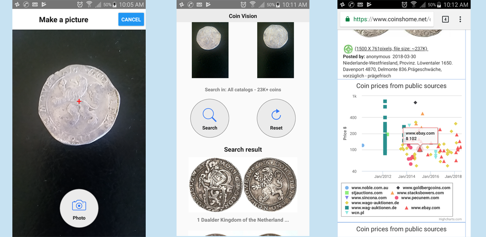

## Machine Learning fun code starter - Coin Vision

### [Coin Vision - search coins by pictures]

It's lightweight code starter to play with multiple modern technologies (Mobile Application with ReactNative, Machine Learning with Tensorflow).
It can be update to work with other collectibles (e.g. post marks, hotel cards, beer cans) with minimum efforts. 

#### Sub Projects

* [web-app](https://github.com/coin-vision/coin-vision/tree/master/web-app "web-app") - Web application to search coins by picture based on trained DNN (tech: Java, SpringBoot, Tensorflow)

* [mobile-app](https://github.com/coin-vision/coin-vision/tree/master/mobile-app "mobile-app") - Mobile application to search coins by picture (tech: JavaScript, ReactNative)

* [dataset-extractor](https://github.com/coin-vision/dataset-extractor "dataset-extractor") - Console application to pull datasets from www.coinshome.net (tech: Java) 

* [dnn-trainer-tf](https://github.com/coin-vision/coin-vision/tree/master/dnn-trainer-tf "dnn-trainer-tf") - Scripts for DNN training (tech: Python, Tensorflow)

You can create and train DNN from scratch (download dataset, train DNN, use DNN in web/mobile app) or just download trained models.

####  Training DNN from scratch

Take a look at _download_convert_train.sh_ and _export_trained_model.sh_

[download_convert_train.sh](https://github.com/coin-vision/coin-vision/blob/master/download_convert_train.sh) - download dataset from www.coinshome.net, convert dataset to *.tfrecord format, train model

[export_trained_model.sh](https://github.com/coin-vision/coin-vision/blob/master/export_trained_model.sh) - export inference graph, freeze the graph and copy it to web-app

#### Using preptrained models

Steps: download trained model, unzip, build app, run app
```
curl https://s3.amazonaws.com/coin-vision/trained-model-usa-coins-398-classes.zip >> temp.zip

unzip temp.zip 

./gradlew clean build

java -jar build/libs/web-app-0.0.2-SNAPSHOT.jar

```
    
Point browser to http://localhost:8888/ and upload coin picture

Available trained models:

USA coins (398 classes) https://s3.amazonaws.com/coin-vision/trained-model-usa-coins-398-classes.zip

Various coins (23303 classes) https://s3.amazonaws.com/coin-vision/trained-model-all-coins-23303-classes.zip


#### Technical overview


#### Mobile application screenshots


