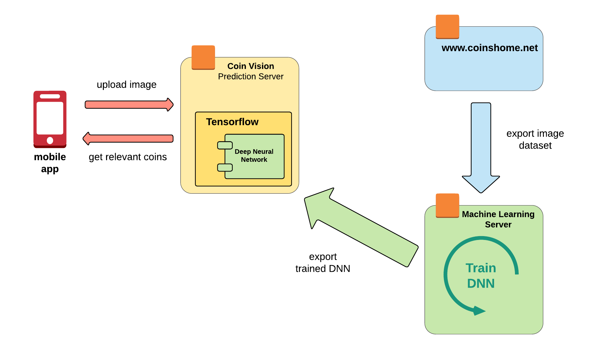

## Machine Learning fun code starter - Coin Vision

### [Coin Vision - search coins by pictures]

It's lightweight code starter to play with multiple modern technologies (Mobile Application with ReactNative, Machine Learning with Tensorflow).
It can be update to work with other collectibles (e.g. post marks, hotel cards, beer cans) with minimum efforts. 

#### Sub Projects

* **web-app** - Web application to search coins by picture based on trained DNN (tech: Java, SpringBoot, Tensorflow)

* **mobile-app** - Mobile application to search coins by picture (tech: JavaScript, ReactNative)

* **dataset-extractor** - Console application to pull datasets from www.coinshome.net (tech: Java) 

* **dnn-trainer-tf** - Scripts for DNN training (tech: Python, Tensorflow)

